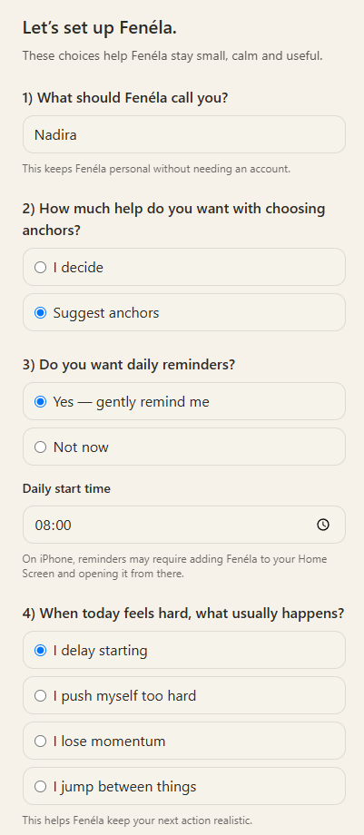
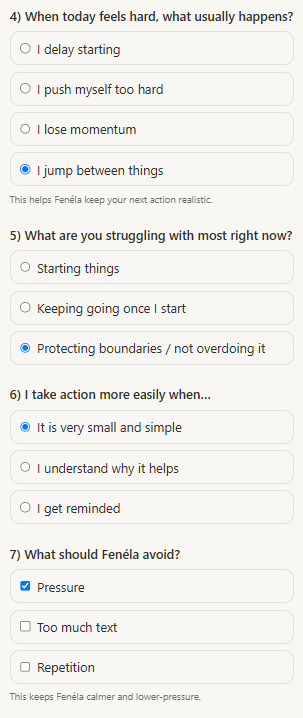
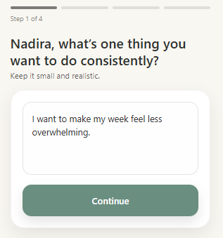
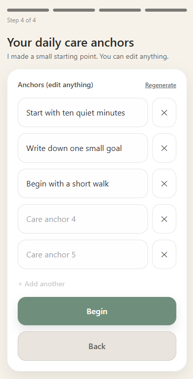
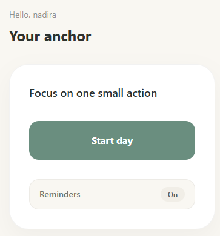
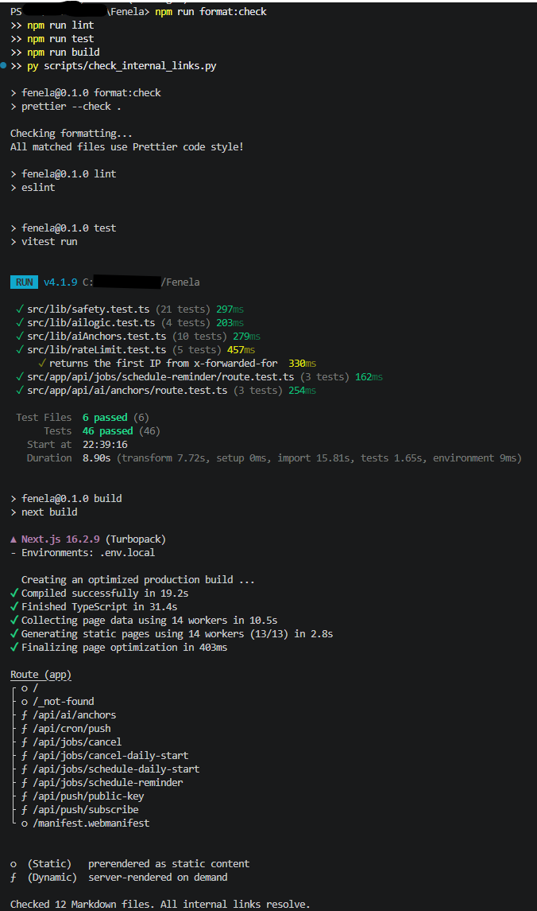
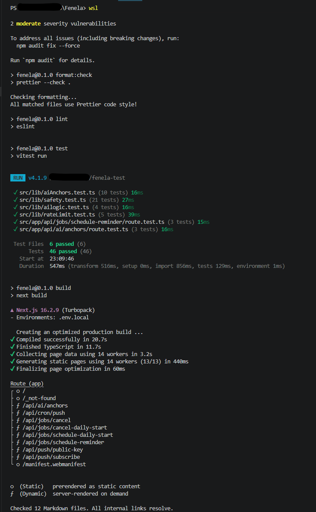

# Fenéla

[](https://github.com/nadira-busse/Fenela/actions/workflows/ci.yml)

Fenéla is a calm accountability app for moments when a goal feels too large to start. It helps the user turn that goal into manageable actions and focus on one step at a time.

The app is built around one focused loop:

```text
overwhelm → one goal → small anchors → one step at a time → gentle accountability → daily return
```

When someone already feels overwhelmed, a larger planning system can add more decisions and more pressure. Fenéla takes a different approach.

The user starts with one goal and explains what is making it difficult. Fenéla can then use optional AI assistance to turn that goal into small, concrete anchors.

During the day, Fenéla presents one anchor at a time. This limits the immediate decision while still allowing the user to work toward a larger goal.

## Why I built this

I built Fenéla around a practical problem: when someone feels overwhelmed, even a simple action can be difficult to start.

Most productivity tools assume that the user is ready to plan, prioritise and make several decisions. Fenéla is designed for moments when that is already too much. It reduces the immediate task by presenting one small, concrete action at a time.

Sometimes the difficulty is not only taking the first step, but identifying what that step should be. Optional AI assistance supports this part of the flow. The user describes one goal, the current friction and why the goal matters. The goal gives Fenéla a direction. The current friction helps it suggest a smaller and more realistic starting point, while the reason behind the goal helps keep the suggestions connected to what matters to the user. Fenéla then generates three small, concrete anchors.

The user can use those anchors as they are, regenerate them, edit them or add their own until the set contains up to five anchors.

The AI provides suggestions, not decisions. The user remains in control of the goal, the selected anchors and what happens next.

Fenéla has a practical and limited role: help the user take a realistic first step, repeat those actions over time and gradually build a routine they can continue independently.

## Screenshots

The screenshots below show the main product flow: setup, goal intake, anchor selection and the accountability screen.

### Setup and personalization

<p>
  
  
</p>

| Goal intake                                                   | AI-assisted anchor suggestions                                                            |
| ------------------------------------------------------------- | ----------------------------------------------------------------------------------------- |
|  |  |

| Accountability screen                                                      |
| -------------------------------------------------------------------------- |
|  |

## Demo

A short demo video is available here:

[Watch the Fenéla demo](https://youtu.be/6Z-GQQ_p8jg)

## Project status

Fenéla is a working application that I use myself. When regular use shows that something can be clearer or work better, I may improve it. I maintain the project at a sustainable pace alongside my other work, without a fixed release schedule.

## What Fenéla does

Fenéla helps a user:

- choose one personal goal;
- describe what is making that goal difficult and why it matters;
- use optional AI assistance to turn the goal into three small anchors;
- use, regenerate, edit or remove the suggested anchors, and add their own until the set contains up to five anchors;
- focus on one anchor at a time;
- mark an anchor as done or postpone it;
- automatically park an anchor for the day after it has been postponed three times;
- enable, disable or adjust optional reminders;
- continue without reminders if they prefer;
- return to the same anchors on another day without rebuilding the plan.

The app is designed for low-friction use. If a feature adds pressure or cognitive load without supporting the core loop, it does not belong in the MVP.

### Reusing saved anchors

Fenéla keeps the user's saved anchors available across days.

This supports two different ways of using the app. Someone who is rebuilding or establishing a routine can repeat the same familiar actions over time instead of creating a new plan every morning. A user working toward a specific daily goal can change the plan whenever that goal changes.

The user can reset the current day while keeping the existing anchors, or start again with a different goal.

## Product boundary

Fenéla is an accountability app, not a therapy, medical or full productivity tool. It does not replace professional support.

## Technical overview

Fenéla is built with Next.js, React and TypeScript.

The application separates:

- React components for the user flow;
- storage helpers for screening, anchors and day state;
- a narrow AI route with separate parsing, validation, repair and fallback logic;
- push and reminder routes for subscriptions, scheduled jobs and delivery.

Vitest covers core application and API behavior. GitHub Actions runs formatting, linting, tests and the production build.

See the [architecture overview](architecture/architecture-overview.md) for the complete structure.

## Engineering quality

The repository includes:

- Prettier and ESLint checks;
- Vitest unit and API-route tests;
- production build validation;
- internal Markdown link checking;
- GitHub Actions for pushes and pull requests;
- rate limiting on public cost- and storage-sensitive routes.

The tests cover AI parsing and fallback behavior, safety validation, route boundaries, reminder payloads and rate limiting.

The CI workflow in `.github/workflows/ci.yml` runs formatting, linting, tests and production build checks on pushes and pull requests.

Fenéla also includes server-side rate limiting on public AI and reminder routes to reduce cost and storage abuse.

Recent validation runs on Windows PowerShell and Linux through WSL are included as runtime evidence:

| Windows PowerShell                                                                                         | Linux through WSL                                                                 |
| ---------------------------------------------------------------------------------------------------------- | --------------------------------------------------------------------------------- |
|  |  |

## Quick start

```bash
npm install
cp .env.example .env.local
npm run dev
```

---

Open the local URL shown in the terminal.

The application requires environment variables for optional AI, Web Push, storage and cron protection. See [Local setup](docs/technical/local-setup.md) for configuration, validation and troubleshooting.

## Environment variables

| Variable                    | Purpose                                                   |
| --------------------------- | --------------------------------------------------------- |
| `OPENAI_API_KEY`            | Enables optional AI-assisted anchor generation            |
| `OPENAI_MODEL`              | Defines the OpenAI model used by the app                  |
| `WEB_PUSH_PUBLIC_KEY`       | Public VAPID key for browser push subscriptions           |
| `WEB_PUSH_PRIVATE_KEY`      | Private VAPID key for sending push notifications          |
| `WEB_PUSH_SUBJECT`          | Contact subject used for VAPID configuration              |
| `STORAGE_KV_REST_API_URL`   | Storage endpoint for reminder and job data                |
| `STORAGE_KV_REST_API_TOKEN` | Token for KV-compatible storage access                    |
| `CRON_SECRET`               | Shared secret used to protect the cron-triggered endpoint |

When connecting a new Upstash or Vercel KV database through an integration, the generated variable names may not match the names used by Fenéla. Fenéla expects the `STORAGE_KV_*` names above.

## Documentation

For a technical review, the suggested reading order is:

1. [Architecture overview](architecture/architecture-overview.md) — application structure, responsibilities and data flow.
2. [AI and ethical-use guardrails](docs/product/ai-guardrails.md) — AI boundaries, safety decisions and user control.
3. [Maintenance notes](docs/technical/maintenance-notes.md) — device cleanup, dependency maintenance and recurring operational details.
4. [MVP scope](docs/product/mvp-scope.md) — implemented functionality and deliberate scope boundaries.

Additional documentation:

- [Known limitations](docs/product/known-limitations.md)
- [Local setup](docs/technical/local-setup.md)

## Author

**Nadira Büsse**

[LinkedIn](https://www.linkedin.com/in/nadirabusse)

## License

Fenéla is available under the [MIT License](LICENSE).

Attribution to the original project is appreciated when Fenéla or substantial parts of it are reused.
