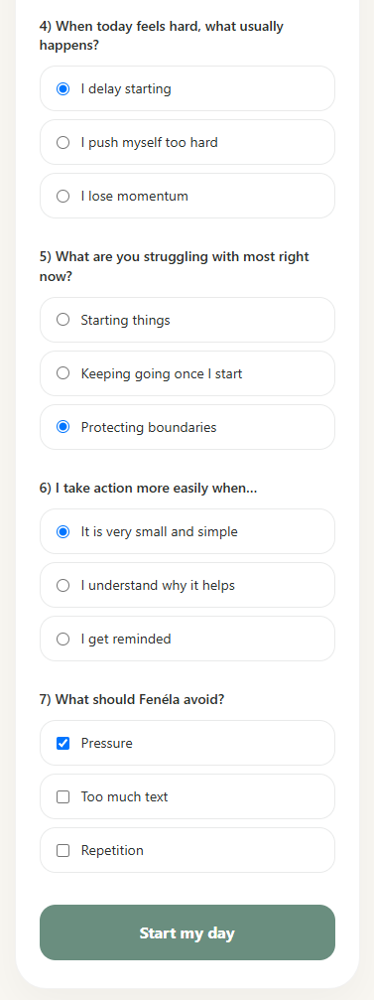
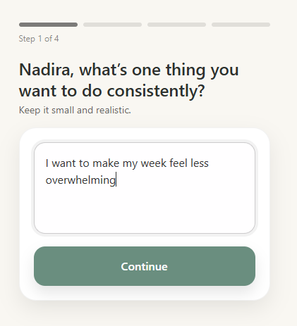
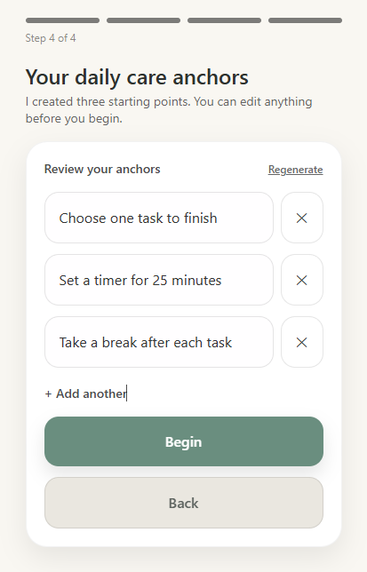
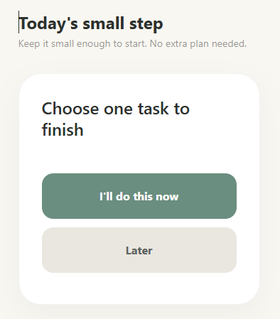

# Fenéla

[](https://github.com/nadira-busse/Fenela/actions/workflows/ci.yml)

## Live application

[Open Fenéla](https://fenela.vercel.app)

---

Fenéla is a calm accountability app for moments when a goal feels too large to start.

It helps the user turn one goal into small, concrete actions and focus on one step at a time.

The product is built around one focused loop:

```text
overwhelm → one goal → small anchors → one step at a time → gentle accountability → daily return
```

When someone already feels overwhelmed, a larger planning system can add more decisions and more pressure. Fenéla takes a smaller approach.

The user chooses one goal, explains what is making it difficult and decides whether they want help choosing small actions. Fenéla can suggest anchors with AI, or the user can create their own.

During the day, Fenéla presents one anchor at a time.

This repository represents the completed MVP2 release of Fenéla.

## Why I built this

I built Fenéla around a practical problem: when someone feels overwhelmed, even a simple action can be difficult to start.

Most productivity tools assume the user is ready to plan, prioritise and make several decisions. Fenéla is designed for the moment before that.

Instead of creating a larger plan, it reduces the immediate decision to one small action.

AI has a deliberately limited role. It can suggest small anchors based on the user's goal and context, but it does not decide what the user should do. Suggestions can be accepted, edited, regenerated or replaced.

The user remains in control.

## Screenshots

The screenshots below show the current product flow from personalization to one small daily action.

### Personalization



### Goal and anchors

| Goal intake                                                   | AI-assisted anchor suggestions                                                            |
| ------------------------------------------------------------- | ----------------------------------------------------------------------------------------- |
|  |  |

### Daily accountability



## What Fenéla does

Fenéla allows a user to:

- sign in with a passwordless email Magic Link;
- set a small number of personal preferences;
- choose one goal;
- describe what is making that goal difficult and why it matters;
- create their own anchors or use optional AI assistance;
- receive three small AI-assisted anchor suggestions;
- edit, regenerate, remove or replace those suggestions;
- keep up to five anchors for a goal;
- focus on one anchor at a time;
- mark an anchor as completed;
- postpone an anchor when it is not the right moment;
- record friction when a step feels difficult;
- automatically park an anchor for the day after repeated postponement;
- enable, disable and change optional daily reminders;
- reset the current day without rebuilding the goal;
- start a new goal when the current one is no longer relevant;
- return to the same goal and anchors across sessions;
- receive a deterministic weekly reflection based on factual activity history;
- delete their account and associated user-owned data.

Fenéla is deliberately small. Features that add cognitive load without strengthening the core accountability loop are kept out of the current product.

## Weekly reflection

Fenéla keeps factual history about completed, postponed and difficult actions.

That history supports a deterministic weekly reflection. The reflection is based on recorded events rather than generated interpretation.

AI is not used to create the reflection facts.

The repository also contains technical support for monthly reflection periods, but a monthly user-facing reflection is not part of the current product.

## Authentication and user-owned data

Fenéla uses Supabase authentication and PostgreSQL-backed persistence.

Users sign in through a passwordless email Magic Link.

Authenticated application data is owned by the signed-in user. Row Level Security and server-side ownership checks are used to keep user-owned records separated.

Canonical persisted data includes:

- user preferences;
- reminder preferences;
- goals;
- anchors;
- action events;
- friction events;
- reflections;
- devices;
- push subscriptions;
- product activity used for retention.

Authenticated user data is persisted in PostgreSQL. Browser storage is used only for limited local UI state.

## Reminders

Daily reminders are optional.

Fenéla separates reminder preferences from device-specific push subscriptions:

- the user's reminder preference stores whether reminders are enabled and the chosen start time;
- device records establish ownership;
- push subscriptions belong to verified devices;
- operational reminder jobs are stored separately from canonical user-owned product data.

If notifications are unavailable or permission is declined, Fenéla continues to work without them.

## Privacy and data lifecycle

Fenéla follows a deliberately limited data model.

The application stores data needed for the product flow, user-owned persistence, reminders, factual history and reflection.

Account deletion removes the user's Fenéla account and associated user-owned data through the same canonical deletion path used by inactivity retention.

Fenéla applies a **12-month inactivity retention policy** based on authenticated product activity.

See [Privacy and data lifecycle](docs/product/privacy-data-lifecycle.md) for the detailed data-purpose and lifecycle model.

## Product boundary

Fenéla is an accountability application.

It is not:

- a therapy application;
- a medical tool;
- a full productivity system;
- an AI planner;
- an autonomous coach.

AI assistance is optional and bounded to anchor suggestions.

## Technical overview

Fenéla is built with:

- Next.js;
- React;
- TypeScript;
- Supabase Auth;
- PostgreSQL;
- Row Level Security;
- Vitest;
- Web Push;
- KV-backed operational reminder storage;
- OpenAI for optional anchor suggestions.

The application separates:

- React components for the product flow;
- authenticated server operations for user-owned persistence;
- deterministic mapping and aggregation logic;
- AI parsing, validation, repair and fallback behavior;
- reminder preferences and device ownership;
- operational push scheduling;
- factual action and friction events;
- deterministic reflection generation;
- account deletion and inactivity retention.

See the [architecture overview](architecture/architecture-overview.md) for the full system structure.

## AI boundary

AI is used for one narrow product function: suggesting anchors.

The AI receives bounded input and returns structured suggestions. The server validates the response before it reaches the product flow.

The implementation includes:

- schema-constrained output;
- parsing and validation;
- bounded repair behavior;
- deterministic fallback anchors when AI generation fails;
- safety checks;
- server-side rate limiting.

The AI provides suggestions, not decisions.

See [AI and ethical-use guardrails](docs/product/ai-guardrails.md) for the detailed boundary.

## Engineering quality

The repository includes:

- Prettier formatting checks;
- ESLint;
- TypeScript validation;
- Vitest unit and API-route tests;
- production build validation;
- internal Markdown link checking;
- GitHub Actions CI;
- rate limiting for cost- and storage-sensitive routes;
- authenticated ownership checks;
- Row Level Security;
- deterministic retention logic;
- controlled failure behavior for account deletion, reminders and reflections.

The current automated test suite contains **479 passing tests across 67 test files**.

GitHub Actions runs formatting, linting, tests and the production build on pushes and pull requests.

Validation has been run locally on Windows PowerShell and Linux through WSL.

## Architecture decisions

Important product and engineering choices are documented as ADRs:

- [ADR-001 — AI-assisted anchors](decisions/ADR-001-ai-assisted-anchors.md)
- [ADR-002 — Optional reminders](decisions/ADR-002-optional-reminders.md)
- [ADR-003 — Authenticated user-owned persistence](decisions/ADR-003-authenticated-user-owned-persistence.md)
- [ADR-004 — Reminder preferences and device ownership](decisions/ADR-004-reminder-preferences-and-device-ownership.md)
- [ADR-005 — Deterministic reflection history](decisions/ADR-005-deterministic-reflection-history.md)

## Run locally

Fenéla requires a local or hosted Supabase project for authentication and persistence.

Start with:

```bash
npm ci
```

Then follow [Local setup](docs/technical/local-setup.md) to start Supabase, apply the database migrations and configure .env.local before running the application.
Open the local URL shown in the terminal.

Fenéla requires configuration for authentication and canonical persistence. AI-assisted anchors, Web Push and operational reminder storage require their corresponding environment variables.

See [Local setup](docs/technical/local-setup.md) for the complete setup and validation process.

## Environment variables

| Variable                               | Purpose                                              |
| -------------------------------------- | ---------------------------------------------------- |
| `SUPABASE_SECRET_KEY`                  | Server-side privileged Supabase operations           |
| `NEXT_PUBLIC_SUPABASE_URL`             | Supabase project URL                                 |
| `NEXT_PUBLIC_SUPABASE_PUBLISHABLE_KEY` | Supabase browser authentication key                  |
| `OPENAI_API_KEY`                       | Enables optional AI-assisted anchor generation       |
| `OPENAI_MODEL`                         | Defines the OpenAI model used for anchor generation  |
| `WEB_PUSH_PUBLIC_KEY`                  | Public VAPID key for browser push subscriptions      |
| `WEB_PUSH_PRIVATE_KEY`                 | Private VAPID key for sending push notifications     |
| `WEB_PUSH_SUBJECT`                     | Contact subject used for VAPID configuration         |
| `STORAGE_KV_REST_API_URL`              | KV-compatible endpoint for operational reminder data |
| `STORAGE_KV_REST_API_TOKEN`            | Token for KV-compatible operational storage          |
| `CRON_SECRET`                          | Shared secret protecting scheduled cron endpoints    |

When a new Upstash or Vercel KV database is connected through an integration, generated environment-variable names may differ from the names Fenéla expects.

## Documentation

For a technical review, the suggested reading order is:

1. [Architecture overview](architecture/architecture-overview.md) — system boundaries, responsibilities and data flow.
2. [MVP scope](docs/product/mvp-scope.md) — current product scope and deliberate exclusions.
3. [AI and ethical-use guardrails](docs/product/ai-guardrails.md) — AI boundaries, safety decisions and user control.
4. [Privacy and data lifecycle](docs/product/privacy-data-lifecycle.md) — stored data, ownership, deletion and retention.
5. [Privacy notice](docs/product/privacy-notice.md) — deployment-facing privacy information and operator responsibilities.
6. [Known limitations](docs/product/known-limitations.md) — current technical and product limitations.
7. [Maintenance notes](docs/technical/maintenance-notes.md) — recurring operational and maintenance details.
8. [Local setup](docs/technical/local-setup.md) — configuration and local validation.

## Author

**Nadira Büsse**

## License

Fenéla is available under the [MIT License](LICENSE).
