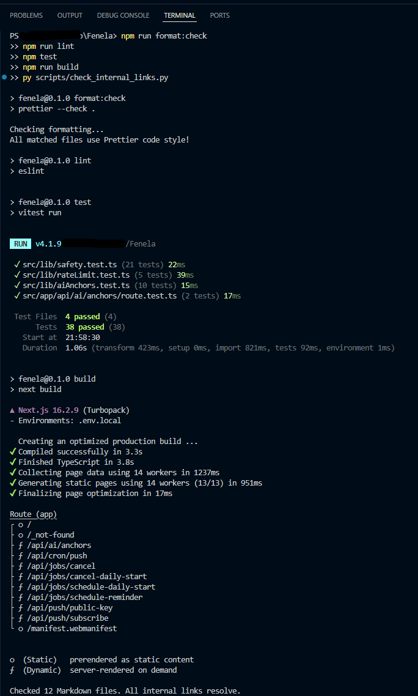

# Fenéla

Fenéla is a small accountability app for moments when everything feels too much.

The app is built around one simple loop:

```text
overwhelm -> one small action -> gentle accountability -> daily return
```

When someone feels overwhelmed, a larger planning system is often not the answer. More options, more dashboards and more pressure can make the problem harder.

Fenéla keeps the next step small. The user chooses one anchor for the day, gets gentle accountability around that action, and can return daily.

This is a public MIT-licensed project. It is also part of my portfolio, because it shows how I approach product scope, safety, and keeping a codebase maintainable.

## Why I built this

I built Fenéla to explore a small product constraint:

```text
Can an app help someone move from overwhelm to one realistic action without turning into another productivity system?
```

That constraint shaped the project.

Fenéla is not trying to solve everything. It is not a full planner, therapy app or coaching platform. It is intentionally narrow: choose one small anchor, receive light accountability, and come back daily.

## Screenshots

Fenéla is intentionally small: setup, one focus, AI-assisted anchor suggestions, and a calm accountability screen.

| Setup preferences                                                        | Personalization choices                                                              |
| ------------------------------------------------------------------------ | ------------------------------------------------------------------------------------ |
|  |  |

| Focus intake                                                   | AI anchor suggestions                                                            |
| -------------------------------------------------------------- | -------------------------------------------------------------------------------- |
|  |  |

| Coaching screen                                                      |
| -------------------------------------------------------------------- |
|  |

## Demo

A short demo video is available here:

[Watch the Fenéla demo](https://youtu.be/nex6pIeaWv0)

## What Fenéla does

Fenéla helps a user:

- name one small action for the day;
- turn that action into a short daily anchor;
- get optional AI-assisted suggestions;
- enable, disable or adjust optional reminders;
- continue without reminders if they prefer;
- avoid being pushed into a large planning workflow.

The app is built around low-friction use. If a feature adds pressure or cognitive load without supporting the core loop, it does not belong in the MVP.

### Daily anchor repetition

Fenéla intentionally repeats the same saved care anchors across days.

This is not a missing variation feature. It is part of the MVP design. The user should not have to make a new plan every day. Repetition lowers choice pressure and makes the app easier to return to.

The user can reset the current day while keeping the same anchors, or start a new goal when the direction no longer fits.

## What Fenéla does not do

Fenéla is intentionally not:

- a therapy app;
- a medical or mental health tool;
- a coaching platform;
- a full productivity suite;
- a habit-tracking dashboard;
- a replacement for professional support.

This boundary matters. Fenéla is meant to support one small action, not diagnose, treat or manage someone's life.

## MVP scope

Current MVP functionality:

- onboarding and screening flow;
- anchor creation flow;
- optional AI-assisted anchor suggestions;
- optional reminders;
- reminder settings for turning reminders on/off and changing the daily start time;
- web push notification infrastructure;
- VAPID-based push configuration;
- KV-backed reminder/job storage;
- cron-triggered reminder processing;
- local environment setup through `.env.local`;
- production build support with Next.js.

Fenéla keeps daily anchors stable by design. The same anchors return when the user resets the day, so the app stays predictable and low-friction.

Out of scope for the MVP:

- user accounts;
- complex dashboards;
- streaks or heavy gamification;
- journaling;
- analytics;
- paid features;
- multi-language support;
- community features;
- advanced AI planning.

The MVP is deliberately small to keep the product easy to use, review and maintain.

## Product principles

Fenéla is designed to be:

- calm;
- lightweight;
- predictable;
- low-friction;
- easy to understand;
- easy to run locally;
- easy to maintain;
- limited in scope.

The main product risk is scope creep. It would be easy to turn Fenéla into a planner, coach, journal or habit system. I chose not to do that for the MVP.

## Tech stack

- Next.js
- React
- TypeScript
- Vitest
- GitHub Actions
- Web Push / VAPID
- Vercel KV-compatible storage
- OpenAI API for optional AI assistance

AI is not the core product. The core product is the accountability loop. AI only supports bounded anchor suggestions.

## Engineering quality

Fenéla includes automated validation for the parts of the app where regressions would matter most.

Current checks include:

- Prettier formatting;
- ESLint;
- Vitest unit and API tests;
- production build validation;
- internal Markdown link checking.

The test suite currently includes 38 tests across:

- safety and ethical-use validation;
- AI response parsing;
- AI anchor validation;
- AI fallback behavior;
- API route validation;
- public route rate limiting.

The CI workflow in `.github/workflows/ci.yml` runs formatting, linting, tests and production build checks on push and pull requests.

Fenéla also includes server-side rate limiting on public AI and reminder routes to reduce cost and storage abuse.

A recent local validation run is included as runtime evidence:



## Local setup

### 1. Install dependencies

```bash
npm install
```

### 2. Create the environment file

Copy the example file:

```bash
cp .env.example .env.local
```

On Windows PowerShell:

```powershell
Copy-Item ".env.example" ".env.local"
```

### 3. Fill the required environment variables

```env
# OpenAI
OPENAI_API_KEY=
OPENAI_MODEL=

# Web Push / VAPID
WEB_PUSH_PUBLIC_KEY=
WEB_PUSH_PRIVATE_KEY=
WEB_PUSH_SUBJECT=

# Vercel KV / storage
STORAGE_KV_REST_API_URL=
STORAGE_KV_REST_API_TOKEN=

# Cron protection
CRON_SECRET=
```

Do not commit `.env.local` or real secrets.

### 4. Run locally

```bash
npm run dev
```

Then open:

```text
http://localhost:3000
```

### 5. Build for production

```bash
npm run build
```

## Quality checks

Before committing changes, run:

```bash
npm run format:check
npm run lint
npm run test
npm run build
```

Run the internal link checker as well.

On Windows:

```powershell
py scripts/check_internal_links.py
```

On macOS/Linux:

```bash
python3 scripts/check_internal_links.py
```

The link checker scans Markdown files in the repository and checks whether relative internal links point to existing files. External links, mail links and in-page anchors are skipped.

## Environment variables

| Variable                    | Purpose                                                   |
| --------------------------- | --------------------------------------------------------- |
| `OPENAI_API_KEY`            | Enables optional AI-assisted anchor generation            |
| `OPENAI_MODEL`              | Defines the OpenAI model used by the app                  |
| `WEB_PUSH_PUBLIC_KEY`       | Public VAPID key for browser push subscriptions           |
| `WEB_PUSH_PRIVATE_KEY`      | Private VAPID key for sending push notifications          |
| `WEB_PUSH_SUBJECT`          | Contact subject used for VAPID configuration              |
| `STORAGE_KV_REST_API_URL`   | Storage endpoint for reminder and job data                |
| `STORAGE_KV_REST_API_TOKEN` | Token for KV-compatible storage access                    |
| `CRON_SECRET`               | Shared secret used to protect the cron-triggered endpoint |

When connecting a new Upstash/Vercel KV database through an integration, the generated variable names may not match the names used by Fenéla. Fenéla expects the `STORAGE_KV_*` names above.

## Documentation

- [MVP scope](docs/product/mvp-scope.md)
- [Product positioning](docs/product/product-positioning.md)
- [AI and ethical use guardrails](docs/product/ai-guardrails.md)
- [Known limitations](docs/product/known-limitations.md)
- [Local setup](docs/technical/local-setup.md)
- [Known technical notes](docs/technical/known-technical-notes.md)
- [UX review](docs/ux/ux-review.md)
- [Architecture overview](architecture/architecture-overview.md)

## Public repository status

This is a public MIT-licensed project.

Others may use, study, adapt and share the software under the MIT License. I do not position Fenéla as an open-source community project. It is a publicly available application and portfolio project.

## Architecture notes

Responsibilities are separated as follows:

- UI and product flow live in the app components;
- local state and day state live in storage helpers;
- AI support is limited to `/api/ai/anchors`;
- AI parsing, validation and fallback logic live in testable library code;
- push subscriptions are handled by push routes;
- reminder jobs are handled by job routes and the cron-triggered push worker;
- device- and IP-based rate limiting helps reduce unbounded cost and storage growth on the AI, subscription and scheduling routes;
- real secrets live outside the repository.

This keeps the codebase small enough to review and maintain.
