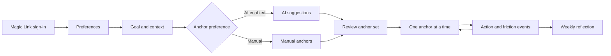

# Architecture Overview

Fenéla is a focused Next.js application built around one accountability loop: define one goal, reduce it to a small set of anchors, work on one anchor at a time and return to recorded factual history.

The architecture separates canonical account state from optional AI assistance and operational reminder delivery. That separation is important because AI output and push infrastructure are useful additions to the product, but neither should become the authority for user-owned state.

## High-level flow



Reminders support the return loop but are not required for core use.

## Responsibility boundaries

| Area                         | Responsibility                                                |
| ---------------------------- | ------------------------------------------------------------- |
| React components             | Product flow, presentation and local screen state             |
| Supabase Auth                | Identity and session establishment                            |
| Authenticated server modules | Derive the current user and enforce account ownership         |
| PostgreSQL                   | Canonical account-owned data behind RLS                       |
| Browser storage              | Limited local UI/device state                                 |
| `/api/ai/anchors`            | Optional anchor-generation boundary                           |
| AI library code              | Parsing, validation, safety checks and deterministic fallback |
| Reminder routes              | Device ownership, subscriptions and job scheduling            |
| KV-compatible storage        | Operational jobs, pointers and rate-limit state               |
| Cron routes                  | Push processing and inactivity retention                      |

## Identity and canonical state

Supabase Auth is the identity root. Authenticated operations derive the user server-side rather than accepting a caller-supplied user ID.

Canonical PostgreSQL state includes:

- user and reminder preferences;
- goals and anchors;
- immutable action and friction events;
- reflection snapshots;
- devices and push subscriptions;
- server-observed activity used for retention.

Row Level Security reinforces ownership at the database layer. Privileged service-role access is used only for narrow server operations that cannot be expressed through the caller's normal RLS-scoped client, such as account lifecycle and reflection insertion.

Browser storage is not the source of truth for account-owned records.

## AI boundary

`POST /api/ai/anchors` is the only production AI flow.

```text
authenticated user input
→ shape/length/safety validation
→ canonical AI-assistance preference check
→ OpenAI (optional)
→ untrusted structured output
→ parse + sanitize + validate + safety check
→ one bounded repair attempt if needed
→ deterministic fallback if AI still fails
→ user review
→ independent persistence validation
→ canonical Goal/Anchor rows
```

The client cannot enable provider processing when the canonical preference says AI assistance is off. A preference lookup failure also fails closed to the deterministic path.

The model receives only the bounded goal/context fields and guidance categories needed for anchor suggestions. It does not receive account identity, event history or reflection history.

AI output has no direct persistence authority. The user must confirm the anchor set, and the server validates it again before writing canonical state.

## Event history and reflection

Action and friction events are immutable factual records. Event time is captured server-side with the relevant local date and timezone information at write time.

The live weekly reflection flow resolves the previous completed Monday–Sunday period. It aggregates counts from stored events and renders deterministic text from that factual snapshot.

A reflection is stored as one immutable row containing its facts snapshot and generated text. Reflection creation is race-safe through a database uniqueness constraint on user, reflection type and period; a concurrent unique conflict is reconciled by re-reading the existing row.

Historical reflections do not reference mutable goal or anchor wording, so later edits cannot change historical output.

## Reminder and push boundary

Reminder behavior is split across three layers:

```text
canonical reminder preference (PostgreSQL)
        ↓
owned device + push subscription (PostgreSQL)
        ↓
operational jobs/pointers (KV)
        ↓
/api/cron/push
        ↓
Web Push provider / device
```

The preference expresses user intent. Device/subscription rows establish ownership and delivery capability. KV jobs are derived operational state.

### One-shot task reminders

A due `TASK_REMINDER` is exclusively claimed before Fenéla attempts delivery. Claim ownership is based on Redis `DEL` semantics: only the invocation that actually removes the job object may call `sendPush`.

Fenéla makes at most one application-level send attempt for that logical reminder. It does not automatically recreate the job after an ambiguous provider failure. This deliberately prefers an occasional missed reminder over Fenéla initiating duplicate reminder attempts.

### Daily-start reminders

`DAILY_START` uses a separate pointer/singleton model. The cron path checks canonical reminder intent before delivery and again before rescheduling. Stale or ambiguous operational job state is discarded rather than guessed.

Push delivery remains best effort because the browser/OS push infrastructure is outside Fenéla's transactional boundary.

## Account lifecycle

User-initiated deletion and inactivity retention share one deletion core.

The flow cleans operational push state before deleting the Auth identity. If required operational cleanup or the final retention eligibility guard fails, deletion stops before the irreversible identity deletion step. Earlier operational cleanup may already have succeeded; retrying the same deletion path is safe and completes any remaining cleanup.

Once Auth deletion succeeds, database cascades remove the associated account-owned rows.

The retention route applies the 12-month inactivity policy and is protected by `CRON_SECRET`.

## HTTP boundaries

| Route                            | Exposure         | Responsibility                        |
| -------------------------------- | ---------------- | ------------------------------------- |
| `/api/ai/anchors`                | Authenticated    | Optional AI anchor suggestions        |
| `/api/push/public-key`           | Public read-only | Public VAPID key                      |
| `/api/push/subscribe`            | Authenticated    | Store an owned device subscription    |
| `/api/push/unsubscribe`          | Authenticated    | Remove an owned subscription          |
| `/api/jobs/schedule-daily-start` | Authenticated    | Create/replace daily-start job        |
| `/api/jobs/schedule-reminder`    | Authenticated    | Create a one-shot reminder job        |
| `/api/jobs/cancel`               | Authenticated    | Cancel one owned job                  |
| `/api/jobs/cancel-daily-start`   | Authenticated    | Cancel active daily-start job/pointer |
| `/api/cron/push`                 | Server-to-server | Process due push jobs                 |
| `/api/cron/retention`            | Server-to-server | Run inactivity retention              |

Authenticated device IDs are identifiers, not authorization credentials. Ownership is checked through the authenticated user and canonical device rows.

## Rate limiting and failure behavior

Routes that create external cost or operational storage growth apply bounded inputs and rate limiting. The shared KV-backed rate limiter intentionally fails open if its supporting store is unavailable; authentication, ownership and input validation remain separate controls.

OpenAI calls have an explicit timeout and fail to deterministic fallback behavior. Provider error logging records bounded structured metadata rather than raw prompt/output or arbitrary provider messages.

## Configuration

Deployment configuration is supplied through environment variables for Supabase, OpenAI, Web Push, KV storage and cron authorization. Server secrets remain outside client bundles and repository history.

See [Local setup](../docs/technical/local-setup.md) and [`.env.example`](../.env.example).

## Design decisions

- [ADR-001: Optional AI-Assisted Anchors](../decisions/ADR-001-ai-assisted-anchors.md)
- [ADR-002: Optional Reminders](../decisions/ADR-002-optional-reminders.md)
- [ADR-003: Authenticated User-Owned Persistence](../decisions/ADR-003-authenticated-user-owned-persistence.md)
- [ADR-004: Reminder Preferences and Device Ownership](../decisions/ADR-004-reminder-preferences-and-device-ownership.md)
- [ADR-005: Deterministic Reflection History](../decisions/ADR-005-deterministic-reflection-history.md)

## Further reading

- [AI and ethical-use guardrails](../docs/product/ai-guardrails.md)
- [Privacy and data lifecycle](../docs/product/privacy-data-lifecycle.md)
- [Known limitations](../docs/product/known-limitations.md)
- [Maintenance notes](../docs/technical/maintenance-notes.md)
