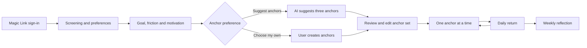
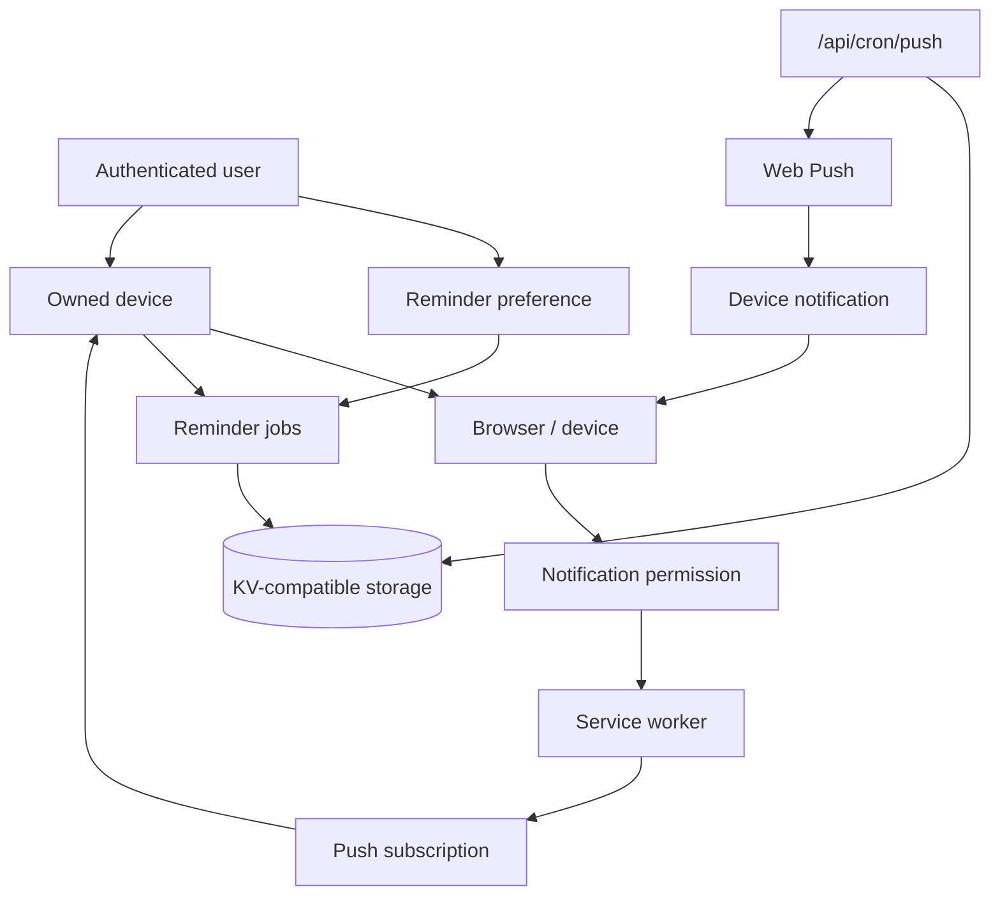

# Architecture Overview

This document describes the current architecture of Fenéla MVP2: its product flow, authentication and ownership boundaries, storage model, AI integration, reminders, retention and supporting infrastructure.

Fenéla is a focused Next.js application. The user signs in, sets a small number of preferences, defines one goal and works through a small set of anchors one at a time.

The architecture keeps the core accountability flow separate from optional AI assistance, reminder delivery and operational infrastructure.

## Architecture goals

The architecture is designed to:

- keep the core accountability flow simple and predictable;
- separate product logic, persistence and operational infrastructure;
- keep authenticated user-owned data clearly bounded;
- use deterministic behavior where the product does not require AI;
- keep AI limited to optional anchor suggestions;
- keep reminders supportive rather than required for the core flow;
- avoid technical complexity that does not solve a current product or maintenance need.

## High-level flow



The product flow starts with authenticated sign-in and a short setup. The user then defines one goal and either creates anchors manually or asks Fenéla for optional AI-assisted suggestions.

After the anchor set is confirmed, Fenéla presents one anchor at a time. Factual action and friction events are stored as the user moves through the flow. These events support the deterministic weekly reflection.

Reminders support the daily return but are not required to use the core accountability flow.

## Main responsibilities

| Area                         | Responsibility                                                                                                                                        |
| ---------------------------- | ----------------------------------------------------------------------------------------------------------------------------------------------------- |
| React components             | Manage the product flow, local screen state and presentation                                                                                          |
| Authentication boundary      | Establish and maintain the Supabase session through Magic Link authentication                                                                         |
| Authenticated server modules | Derive user identity server-side and enforce ownership for preferences, goals, anchors, events, reflections, devices and account lifecycle operations |
| Canonical PostgreSQL storage | Persist authenticated user-owned data behind Row Level Security                                                                                       |
| Browser storage              | Hold limited local UI, compatibility and device state                                                                                                 |
| AI route                     | Validate intake and request three optional anchor suggestions                                                                                         |
| AI library logic             | Handle parsing, sanitization, validation, repair and deterministic fallback behavior                                                                  |
| Reminder preferences         | Persist the user's reminder choice and selected daily start time                                                                                      |
| Device and push ownership    | Associate push subscriptions with verified user-owned devices                                                                                         |
| Job routes                   | Schedule and cancel daily-start and one-shot reminder jobs                                                                                            |
| Cron routes                  | Process due push jobs and run inactivity retention                                                                                                    |
| KV-compatible storage        | Hold operational reminder jobs, push-delivery state and rate-limit counters                                                                           |
| Environment configuration    | Keep deployment-specific configuration and secrets outside the repository                                                                             |

## Authentication and ownership boundary

Fenéla uses Supabase Auth as the identity root for persistent user-owned data.

New users authenticate before entering the screening flow. Magic Link authentication establishes the session used by authenticated server operations.

The main authentication and session routes are:

```text
/auth
/auth/callback
/auth/signout
```

`/auth` and `/auth/callback` are public authentication entry points. They allow a user to request a Magic Link and establish a session.

Authenticated application operations derive identity server-side rather than accepting a user ID from the browser.

Server modules use `requireUser()` or related session helpers before reading or changing user-owned records.

This boundary applies to data such as:

- user preferences;
- reminder preferences;
- goals;
- anchors;
- action events;
- friction events;
- reflections;
- devices;
- push subscriptions;
- account deletion.

PostgreSQL Row Level Security provides an additional ownership boundary at the database layer.

## State and storage boundaries

Fenéla uses three storage layers with different responsibilities.

### Canonical PostgreSQL storage

Supabase PostgreSQL is the source of truth for authenticated user-owned data.

It stores:

- user preferences;
- reminder preferences;
- goals;
- anchors;
- action events;
- friction events;
- reflections;
- devices;
- push subscriptions;
- authenticated product activity used for retention.

Ownership is enforced through authenticated server boundaries and Row Level Security.

Data that must remain associated with the user's account across sessions is persisted here.

### Browser storage

Browser storage is used for limited local UI, compatibility and device state.

This includes state such as:

- current day state;
- local compatibility values used by existing screens;
- device identifiers;
- limited reminder-related local state.

Authenticated account data is persisted in PostgreSQL rather than relying on browser storage as its source of truth.

### KV-compatible server storage

KV-compatible storage is used for operational state that supports reminders and rate limiting.

It stores data such as:

- scheduled reminder jobs;
- daily reminder pointers;
- operational push-delivery state;
- device-indexed job state;
- rate-limit counters.

This layer is not the ownership source for user data. Account and device ownership remain in PostgreSQL.

## AI architecture

The `/api/ai/anchors` route has one narrow product responsibility: provide optional anchor suggestions.

The route:

1. validates the request and intake;
2. rejects invalid or clearly unsafe input;
3. requests structured AI output when suggestions are enabled;
4. parses, sanitizes and validates the response;
5. makes one constrained repair attempt if the first response is invalid;
6. returns deterministic local suggestions when the AI service is unavailable, rate-limited or still invalid after repair.

Invalid or unsafe user input is rejected rather than converted into fallback suggestions.

When the user chooses to create anchors manually, the AI route is not needed.

The route handler coordinates the HTTP request and model call. Reusable behavior remains in testable library code, including:

- response parsing;
- sanitization;
- anchor validation;
- safety validation;
- repair handling;
- fallback behavior.

This keeps model-specific behavior separated from product flow logic.

AI is optional. Fenéla remains usable as an accountability application without model-generated suggestions.

## Factual history and reflection

Fenéla records factual ActionEvent and FrictionEvent history as the user interacts with anchors.

Examples include:

- starting an anchor;
- completing an anchor;
- postponing an anchor;
- parking an anchor for the day;
- recording why a step felt difficult.

These records provide the factual input for weekly reflection.

Reflection facts are generated deterministically from stored history. AI is not used to create the factual reflection record.

The codebase also contains deterministic support for monthly reflection periods, but the current product exposes the weekly reflection flow.

See [ADR-005: Deterministic Reflection History](../decisions/ADR-005-deterministic-reflection-history.md).

## Route groups

### AI

```text
/api/ai/anchors
```

Provides optional anchor suggestions from the user's goal, friction and motivation.

### Reminder jobs

```text
/api/jobs/schedule-daily-start
/api/jobs/schedule-reminder
/api/jobs/cancel
/api/jobs/cancel-daily-start
```

These routes create and cancel operational reminder jobs.

Some reminder routes retain device-based behavior for compatibility. Authenticated flows use canonical reminder preferences and verified device ownership where required.

### Push

```text
/api/push/public-key
/api/push/subscribe
/api/push/unsubscribe
```

`/api/push/public-key` returns the public VAPID key.

`/api/push/subscribe` stores or replaces a browser push subscription and supports the device-ownership flow used by authenticated users.

`/api/push/unsubscribe` is an authenticated user-owned operation and verifies the device boundary before removing the subscription.

### Cron processing

```text
/api/cron/push
/api/cron/retention
```

`/api/cron/push` processes due reminder jobs and sends push notifications.

`/api/cron/retention` applies the 12-month inactivity policy by identifying expired accounts and passing them through the same canonical deletion core used for user-initiated account deletion.

Both routes are server-to-server boundaries protected by `CRON_SECRET`.

They are not user-facing application routes.

## HTTP security boundaries

Fenéla separates authenticated user operations, public read-only configuration and server-to-server cron operations.

| Route                            | Method | Exposure         | Effect                                                               | Protection                                                                                        |
| -------------------------------- | ------ | ---------------- | -------------------------------------------------------------------- | ------------------------------------------------------------------------------------------------- |
| `/api/ai/anchors`                | `POST` | Authenticated    | Generates optional anchor suggestions and may write rate-limit state | Session authentication, input limits, safety checks, rate limiting and external spending controls |
| `/api/push/public-key`           | `GET`  | Public read-only | Returns the public VAPID key                                         | Returns public configuration only                                                                 |
| `/api/push/subscribe`            | `POST` | Authenticated    | Stores or replaces an owned device subscription                      | Session authentication, device ownership verification, input validation and rate limiting         |
| `/api/jobs/schedule-daily-start` | `POST` | Authenticated    | Creates or replaces the authenticated user's daily reminder job      | Session authentication, device ownership, canonical reminder preference and rate limiting         |
| `/api/jobs/schedule-reminder`    | `POST` | Authenticated    | Stores a one-shot reminder for an owned device                       | Session authentication, device ownership, payload limits and rate limiting                        |
| `/api/jobs/cancel`               | `POST` | Authenticated    | Deletes one job belonging to an owned device                         | Session authentication and device ownership verification                                          |
| `/api/jobs/cancel-daily-start`   | `POST` | Authenticated    | Deletes the active daily-start job and pointer for an owned device   | Session authentication and device ownership verification                                          |
| `/api/push/unsubscribe`          | `POST` | Authenticated    | Removes a push subscription belonging to an owned device             | Session authentication and device ownership verification                                          |
| `/api/cron/push`                 | `GET`  | Server-to-server | Processes reminder jobs and push delivery                            | `CRON_SECRET`                                                                                     |
| `/api/cron/retention`            | `GET`  | Server-to-server | Runs account inactivity retention                                    | `CRON_SECRET`                                                                                     |

A device ID identifies a browser or installed application instance. It is not proof of user identity and is never treated as an authorization credential.

Account-owned operations derive user identity from the authenticated server session and verify ownership before reading or mutating device-specific state.

## Rate limiting and abuse boundaries

Rate limiting is applied to routes that can create external cost or operational storage growth, in addition to authentication where applicable:

```text
/api/ai/anchors
/api/push/subscribe
/api/jobs/schedule-daily-start
/api/jobs/schedule-reminder
```

The AI route protects the OpenAI-cost path.

Subscription and reminder routes limit repeated operational writes.

Relevant routes also enforce bounded request values, including intake length, reminder delay, notification title, body and URL values.

When the AI route reaches its application rate limit, Fenéla returns deterministic suggestions using the existing response shape.

Reminder and subscription routes return HTTP `429` when their limits are reached.

The shared rate limiter uses the existing KV-compatible store. It fails open when that supporting store is unavailable or the rate-limit check itself fails. This keeps a supporting guardrail from blocking the core product flow, but means application rate limiting is not a complete abuse-prevention system.

External OpenAI spending controls remain an additional cost boundary outside the repository.

## Reminder and push architecture

Fenéla separates reminder preferences, device ownership and operational delivery.



The reminder flow separates three concerns:

- the user's reminder preference describes product behavior;
- the device and push subscription describe delivery ownership and capability;
- KV-backed jobs describe operational scheduling.

The user can enable, disable or change reminders after onboarding.

Turning reminders off cancels the active daily-start job. The underlying push subscription may remain available as device infrastructure.

This distinction keeps product preference separate from delivery mechanics.

## Service worker

The service worker lives in:

```text
public/sw.js
```

It handles incoming browser push notifications.

Push delivery depends on:

- browser support;
- device behavior;
- notification permission;
- service worker registration;
- deployment configuration.

Web Push therefore supports the accountability flow but is not treated as guaranteed delivery.

## Account lifecycle

Fenéla supports user-initiated account deletion.

The deletion flow:

1. verifies the authenticated user;
2. removes operational reminder and device-related state where required;
3. deletes the authenticated identity through the canonical account-deletion path;
4. relies on the database ownership model and cascades for associated user-owned records.

The inactivity retention process uses the same canonical deletion core.

Fenéla applies a 12-month inactivity policy based on authenticated product activity.

See [Privacy and data lifecycle](../docs/product/privacy-data-lifecycle.md) for the detailed data and retention model.

## Configuration boundary

Deployment-specific configuration is provided through environment variables.

The main configuration areas are:

- Supabase authentication and persistence;
- OpenAI access;
- Web Push and VAPID;
- KV-compatible operational storage;
- cron authorization.

Server secrets remain outside client code and outside the repository.

See:

- [Local setup](../docs/technical/local-setup.md)
- [`.env.example`](../.env.example)

for the configuration required to run Fenéla.

## Key architecture decisions

### Optional AI

AI is isolated behind one product boundary and remains optional.

See [ADR-001: Optional AI-Assisted Anchors](../decisions/ADR-001-ai-assisted-anchors.md).

### Optional reminders

Reminder delivery supports the product but does not determine whether the accountability flow itself can function.

See [ADR-002: Optional Reminders](../decisions/ADR-002-optional-reminders.md).

### Authenticated user-owned persistence

Supabase Auth establishes identity and PostgreSQL provides canonical user-owned persistence.

The repository includes:

- version-controlled schema and constraints under `supabase/migrations/`;
- Row Level Security;
- browser/server Supabase client boundaries;
- server-derived authenticated identity;
- canonical user and reminder preferences;
- Goal and Anchor persistence;
- immutable ActionEvent and FrictionEvent history;
- Reflection persistence;
- authenticated Device and PushSubscription ownership;
- operational KV state separated from canonical account data.

See:

- [ADR-003: Authenticated User-Owned Persistence](../decisions/ADR-003-authenticated-user-owned-persistence.md)
- [ADR-004: Reminder Preferences and Device Ownership](../decisions/ADR-004-reminder-preferences-and-device-ownership.md)
- [ADR-005: Deterministic Reflection History](../decisions/ADR-005-deterministic-reflection-history.md)

### Safety and validation

Safety controls are split across several layers:

- input-quality checks reject meaningless intake;
- deterministic checks block explicit unsafe intent;
- AI instructions define the model boundary;
- generated output is parsed and validated before use;
- cost- and storage-sensitive routes apply payload limits and rate limiting;
- authenticated operations derive identity server-side;
- database ownership is reinforced by Row Level Security;
- secrets remain outside client code and repository history.

These controls reduce risk but do not claim complete moderation, abuse prevention or delivery reliability.

The AI-specific boundaries are documented in [AI and ethical-use guardrails](../docs/product/ai-guardrails.md).

Operational details are documented in [Maintenance notes](../docs/technical/maintenance-notes.md).

## Scope boundary

Fenéla is intentionally narrow.

The architecture supports the current accountability loop rather than preparing speculative infrastructure for future features.

Product exclusions such as dashboards, streaks, journaling and advanced AI planning are documented in [MVP scope](../docs/product/mvp-scope.md).

New abstractions should be added only when they solve a demonstrated product, security or maintenance problem.

## Further reading

- [MVP scope](../docs/product/mvp-scope.md)
- [AI and ethical-use guardrails](../docs/product/ai-guardrails.md)
- [Privacy and data lifecycle](../docs/product/privacy-data-lifecycle.md)
- [Maintenance notes](../docs/technical/maintenance-notes.md)
- [ADR-001: Optional AI-Assisted Anchors](../decisions/ADR-001-ai-assisted-anchors.md)
- [ADR-002: Optional Reminders](../decisions/ADR-002-optional-reminders.md)
- [ADR-003: Authenticated User-Owned Persistence](../decisions/ADR-003-authenticated-user-owned-persistence.md)
- [ADR-004: Reminder Preferences and Device Ownership](../decisions/ADR-004-reminder-preferences-and-device-ownership.md)
- [ADR-005: Deterministic Reflection History](../decisions/ADR-005-deterministic-reflection-history.md)
