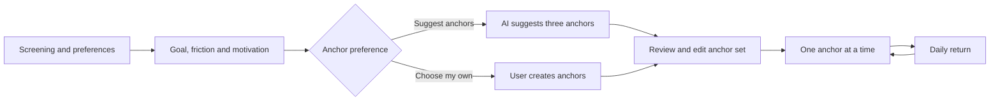
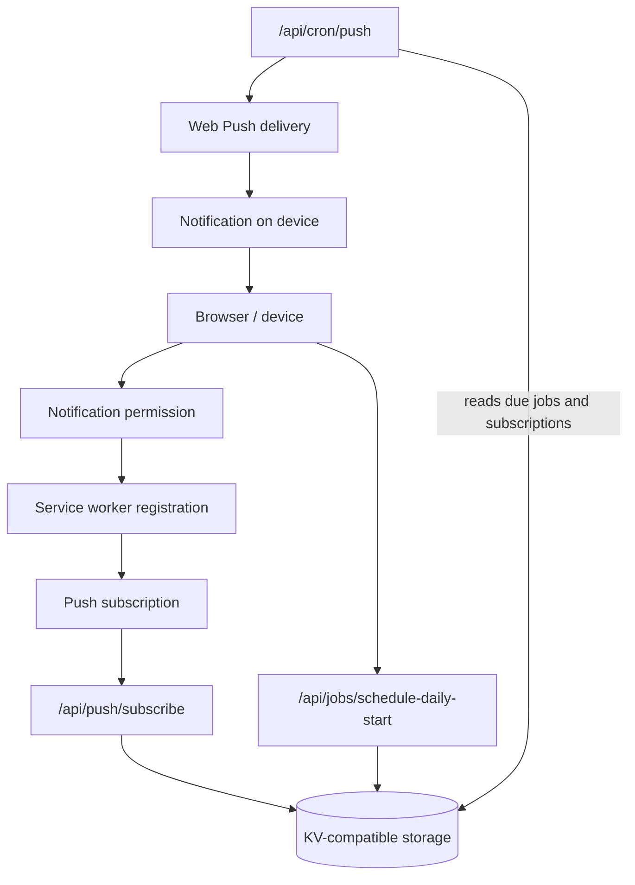

# Architecture Overview

This document describes the architecture of Fenéla MVP 1, including the current application, its routes, storage model and optional AI and reminder capabilities.

Fenéla is a focused Next.js application. The user moves from one stated goal to a small set of anchors and then works through one anchor at a time.

The core user experience remains separate from optional AI assistance, reminder delivery and supporting infrastructure. Server routes are used where they add clear value without making the main flow harder to understand.

## Architecture goals

The current architecture keeps:

- the repository understandable;
- local setup and validation straightforward;
- responsibilities separated;
- state movement predictable;
- abstractions limited to demonstrated needs;
- AI and reminders optional within the user flow.

## High-level flow



The core product flow runs from screening and goal intake to an editable anchor set, followed by one anchor at a time. AI can help generate the initial suggestions, but the user can also create the anchors manually. Reminders support the daily return and remain separate from the core flow.

## Main responsibilities

| Area                      | Responsibility                                                                       |
| ------------------------- | ------------------------------------------------------------------------------------ |
| React components          | Manage the user flow, screen state and presentation                                  |
| Client storage            | Preserves screening answers, saved anchors, day state and local reminder preferences |
| AI route                  | Validates intake and requests three optional anchor suggestions                      |
| AI library logic          | Handles parsing, sanitization, validation, repair and fallback behavior              |
| Push routes               | Manage the public key and browser push subscriptions                                 |
| Job routes                | Schedule and cancel daily-start and reminder jobs                                    |
| Cron route                | Reads due jobs and sends push notifications                                          |
| Server storage            | Stores subscriptions, device references, reminder jobs and rate-limit state          |
| Environment configuration | Keeps deployment-specific values and secrets outside the repository                  |

## State and storage boundaries

Fenéla uses two storage layers.

### Browser storage

The browser stores:

- screening answers;
- saved anchors;
- active and parked day state;
- local reminder preferences;
- device-specific identifiers.

This keeps the main product usable without a user account system.

### KV-compatible server storage

The server stores:

- push subscriptions;
- registered device references;
- scheduled reminder jobs;
- daily reminder pointers;
- rate-limit counters.

The MVP has no user account database or cross-device profile.

## AI architecture

The `/api/ai/anchors` route has a narrow responsibility:

1. validate the request and intake;
2. reject invalid or clearly unsafe input;
3. request structured AI output when suggestions are enabled;
4. parse, sanitize and validate the response;
5. make one constrained repair attempt when the first response is invalid;
6. return local deterministic suggestions when the AI service is unavailable, rate-limited or still produces invalid output after repair.

Invalid or unsafe user input is rejected. Fenéla shows a clear message asking the user to choose a safe, lawful and respectful goal instead of generating fallback suggestions. When the user chooses to create anchors manually, the route does not call the AI service.

The route handler orchestrates the request and model call.

Reusable behavior remains outside the route in testable library code. This includes:

- response parsing;
- sanitization;
- anchor validation;
- safety validation;
- repair handling;
- fallback behavior.

This separation keeps the AI behavior easier to test and prevents the route handler from becoming the only place where application rules live.

AI is optional. The application should remain understandable as an accountability product without requiring the user to rely on model-generated suggestions.

## Route groups

### AI

```text
/api/ai/anchors
```

Generates optional anchor suggestions from the user's goal, friction and motivation.

### Reminder jobs

```text
/api/jobs/schedule-daily-start
/api/jobs/schedule-reminder
/api/jobs/cancel
/api/jobs/cancel-daily-start
```

These routes create and cancel reminder jobs.

### Cron processing

```text
/api/cron/push
```

This server-to-server route reads due reminder jobs and sends push notifications.

### Push setup

```text
/api/push/public-key
/api/push/subscribe
```

These routes provide the public VAPID key and store browser push subscriptions.

## Route boundaries

The current application has no user authentication. Public routes therefore rely on validation, bounded payloads and rate limiting rather than verified user identity.

| Route                            | Method | Exposure         | Data effect                                                        | Cost or storage effect    | Protection                                                                              |
| -------------------------------- | ------ | ---------------- | ------------------------------------------------------------------ | ------------------------- | --------------------------------------------------------------------------------------- |
| `/api/ai/anchors`                | `POST` | Public           | Does not persist user content; may write rate-limit state          | Can use OpenAI credits    | Intake limits, safety checks, device-based rate limiting and external spending controls |
| `/api/push/public-key`           | `GET`  | Public read-only | Returns the public VAPID key                                       | No storage growth         | Returns only public configuration                                                       |
| `/api/push/subscribe`            | `POST` | Public write     | Stores or replaces a device subscription                           | Can create KV records     | Input validation and device/IP rate limiting                                            |
| `/api/jobs/schedule-daily-start` | `POST` | Public write     | Replaces and stores a daily reminder job                           | Can create KV records     | Existing subscription requirement and device rate limiting                              |
| `/api/jobs/schedule-reminder`    | `POST` | Public write     | Stores a task reminder job                                         | Can create KV records     | Payload limits and device/IP rate limiting                                              |
| `/api/jobs/cancel`               | `POST` | Public write     | Deletes one device job                                             | No storage growth         | Requires a device ID and job ID                                                         |
| `/api/jobs/cancel-daily-start`   | `POST` | Public write     | Deletes the active daily reminder job and pointer                  | No storage growth         | Requires a device ID                                                                    |
| `/api/cron/push`                 | `GET`  | Server-to-server | Reads, deletes and reschedules jobs, then sends push notifications | Can trigger push delivery | Requires `CRON_SECRET` through Bearer authorization                                     |

Device IDs identify a browser or installed PWA. They do not prove user identity.

### Rate limiting and abuse boundaries

Rate limiting is applied to the public routes that can create external cost or KV growth:

```text
/api/ai/anchors
/api/push/subscribe
/api/jobs/schedule-daily-start
/api/jobs/schedule-reminder
```

The AI route limits the OpenAI-cost path. Subscription and reminder routes limit repeated writes. Relevant routes also bound request size, including intake length, reminder delay, title, body and URL values.

When the AI route reaches its limit, Fenéla returns deterministic suggestions in the existing response shape. Reminder and subscription routes return HTTP `429`.

The shared rate limiter uses the existing KV store and fails open when KV is unavailable or the check itself errors. This prevents a supporting guardrail from blocking the core flow, but it also means rate limiting is not complete abuse prevention.

Account-level OpenAI spending limits remain the final cost backstop outside the repository.

The cron route is not public application traffic. It requires `CRON_SECRET` and rejects unauthorized requests.

## Reminder and push architecture

Fenéla uses device-based reminders.



The reminder flow separates three concerns:

- the browser owns notification permission and service worker registration;
- API routes store subscriptions and schedule jobs;
- the cron route processes due jobs and sends notifications.

Reminder settings remain separate from screening.

Screening records the first-run preference. The reminder settings allow the user to enable, disable or adjust reminders later on the current device.

Turning reminders off cancels the active daily-start job for that device. It does not need to delete the underlying push subscription.

The distinction matters:

- the subscription is device infrastructure;
- the enabled or disabled reminder state is product behavior.

### Service worker

The service worker lives in:

```text
public/sw.js
```

It handles incoming browser push notifications.

Delivery reliability depends on:

- browser support;
- device behavior;
- notification permission;
- service worker registration;
- deployment configuration.

Web Push is therefore useful support, but it is not treated as guaranteed delivery.

## Configuration boundary

Deployment-specific configuration is provided through environment variables.

The main configuration areas are:

- OpenAI access;
- Web Push and VAPID;
- KV-compatible storage;
- cron authorization.

Secrets remain server-side and outside the repository. See [Local setup](../docs/technical/local-setup.md) and [`.env.example`](../.env.example) for the complete configuration list.

## Key architecture decisions

### Optional AI

AI is isolated behind one route and remains outside the core product dependency.

See [ADR-001: Optional AI-Assisted Anchors](../decisions/ADR-001-ai-assisted-anchors.md)

### Optional reminders

Reminder setup does not block onboarding or the accountability flow.

See [ADR-002: Optional Reminders](../decisions/ADR-002-optional-reminders.md).

### No user accounts

The current version uses local and device-based state and does not require a user account.

This keeps the current implementation focused by avoiding:

- authentication and authorization;
- profile and account management;
- cross-device synchronization;
- additional persistent personal data;
- account recovery and deletion flows.

Accounts are not required for the current core loop. They are not ruled out for a future version if a clear product need emerges, such as cross-device continuity or user-controlled long-term insights.

Introducing accounts would require a separate product and architecture decision because it changes the data, privacy and security model.

### Accepted MVP2 identity and persistence direction

The current release still has no user accounts and remains browser- and device-based.

For MVP2, a separate architecture decision has now been accepted: persistent personal history will belong to an authenticated user rather than to a browser-generated device identity.

The accepted MVP2 baseline uses Supabase Auth with PostgreSQL for user-owned persistence.

This is a planned architecture change and is **not implemented in the current release**.

See:

- [ADR-003: Authenticated User-Owned Persistence](../decisions/ADR-003-authenticated-user-owned-persistence.md)
- [ADR-004: Reminder Preferences and Device Ownership](../decisions/ADR-004-reminder-preferences-and-device-ownership.md)
- [ADR-005: Deterministic Reflection History](../decisions/ADR-005-deterministic-reflection-history.md)

### Safety and validation

Safety controls are split across several layers:

- input-quality checks reject meaningless intake;
- a deterministic pattern filter blocks explicit unsafe intent;
- AI prompts define a broader behavioral boundary;
- generated output is parsed and validated before use;
- public routes apply payload limits and rate limiting;
- secrets remain outside client code and repository history.

These controls reduce risk. They do not create complete content moderation, identity verification or abuse prevention.

The AI-specific limits are documented in [AI and ethical-use guardrails](../docs/product/ai-guardrails.md). Operational cleanup and dependency details are documented in [Maintenance notes](../docs/technical/maintenance-notes.md).

## Future architecture decisions

MVP2 now has accepted architecture decisions for:

- authenticated user-owned persistence;
- reminder preferences separated from device and push delivery;
- persistent action and friction history;
- deterministic weekly and monthly reflection facts;
- optional bounded AI wording on top of those facts.

These decisions are documented in ADR-003 through ADR-005.

They are **not implemented in the current release**.

Several implementation details still need to be resolved before MVP2 is complete, including:

- the final relational schema;
- retention periods;
- account deletion behavior;
- exact timezone and calendar-boundary behavior;
- multi-device reminder behavior;
- data-access boundaries in the application code.

These details should be decided when the implementation reaches the relevant responsibility rather than being abstracted in advance.

The product boundary remains unchanged: Fenéla should stay calm, small and focused even as persistence and ownership become more explicit.

## Scope boundary

Product exclusions such as accounts, dashboards, streaks, journaling and advanced AI planning are documented in [MVP scope](../docs/product/mvp-scope.md).

The architecture does not prepare for those features in advance. New abstractions should only be added when they solve an actual product or maintenance problem.

## Further reading

- [MVP scope](../docs/product/mvp-scope.md)
- [AI and ethical-use guardrails](../docs/product/ai-guardrails.md)
- [Maintenance notes](../docs/technical/maintenance-notes.md)
- [ADR-001: Optional AI-Assisted Anchors](../decisions/ADR-001-ai-assisted-anchors.md)
- [ADR-002: Optional Reminders](../decisions/ADR-002-optional-reminders.md)
